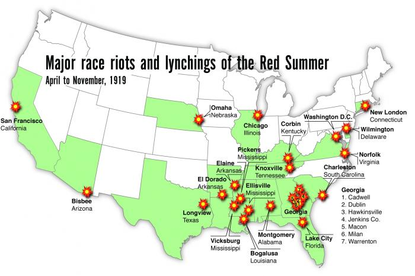
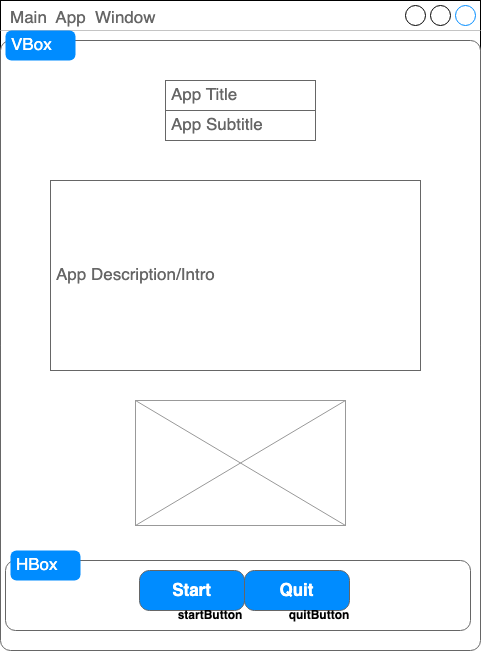
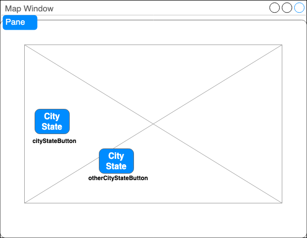
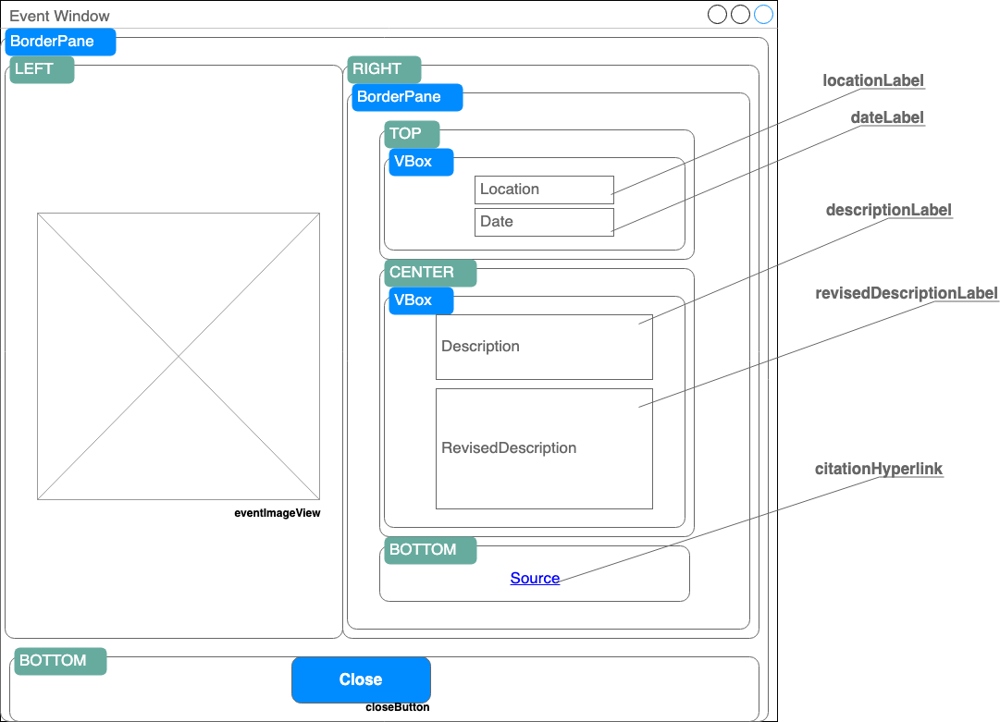

# Lab #9 - Red Summer + MVC

Our first lab, Inheritance, involved applying our CS concept within the context of the Tulsa Race Massacre and revising history. It attempted to begin righting a wrong by educating the user in the difference and power in language. With our current knowledge of GUIs, we can take another attempt at it using a more visual medium!

Sample app (including hacker challenge):

## Wireframes

### Wireframe for the window that launches when program runs (main view):

_Note: button names below button, HBox layout within VBox layout. Image placeholder is for app "logo"_

### Wireframe for map, main window changes to this (map view) when Start button clicked: 

_Note: names of buttons are generic, should actually be of city and state in button (ex: Bisbee, Arizona button should be names bisbeeAzButton). Pane layout used because it allows absolute positioning (just drag/place where you want things on the window)_

### Wireframe for specific city event info (event view) that will open in new window:

_Note: lots of layouts here! play close attention to which one's inside of which._ 

## Step 1: Views - Get the Look Down
Create each view in the `resources` folder's `cs112.lab09` folder as a separate FXML file. Get it to look as close to the final as you can using SceneBuilder.

For each view:
- Use the wireframes as your guide on which layouts to use, where to place components, etc.
- Use the sample screenshot to get the details closer to finished (alignment, placement, font weight like bold, etc.)
- Make sure to set the `fx:id` for each GUI component (at the very least, the ones your code will have to interact with. They are already named in each wireframe)
- While you're at it, specify the name of the method you'll create for the "On Action" for all the buttons

## Step 2: Controller - Get a Rough Flow Down

You got a rough look down, let's get multiple scenes to work! Our goal basically is that if you click a button that should open up the next screen, that's it!

In this case, the main app window has a "Start" button that *changes* the main app window the map window. Then when you click on a specific event in the map, it *opens a popup* window to show that events detailed information. Our goal is to get that flow working (the actual data and details will be left for [Step 3](#Step-3))

Create a controller for each view (you should have 3) in the `controllers` package within the `cs112.lab09` package in the `src/main/java` folder. For each controller:
- update the view's FXML file to have the `fx:controller=` property set to a string for the controller (this should include the full package name, `cs112.lab09.controllers`, and the name of your controller. See `main-view.fxml` if you want an example)
- declare all GUI components, don't forget the `@FXML` above each one!
- create your "On Action" methods for any event handling. Don't fill in the body of the methods! Just put a `println` statement to print "I clicked X button" or something to the console so you see things are connected well. Again, you'll add the actual functionality of those buttons in the next step.
- for any buttons that change a scene or open a popup, add that functionality! (`MainController`'s "Start" button changes the scene, `MapController`'s buttons all open a new popup window)

## Step 3: Functionality - Get it Working

Now that have you have the look and flow down roughly, start adding the details of how things are displayed and actually work!

Suggested order and tips for each controller:
- `MainController`
  - takes care of the main app window, it's only 2 buttons so you're focusing on the "On Action" methods you specified in [Step 1](#Step-1)
  - your "Start" button should swap the scene for the map view, not opening a new window!
- `MapController`
  - displays map with buttons for each event
  - it will have as many buttons as events you add (at least 2 required like in sample screenshots)
  - it will have one "On Action" method for each button that will open a new (popup) window for the event
- `EventController`
  - displays event info for specific RevisedHistoricalEvent
  - it will have all the `Label` and `Button` components (plus `ImageView` and `Hyperlink` component if you do hacker challenge)
  - it will have instance variables for the `String` location and `RevisedHistoricalEvent` object for this event (and image location if doing the hacker challenge)
  - it will have an `initData(String location, RevisedHistoricalEvent event)` method that will set those instance variables and update all the GUI components with the corresponding data
  - it will have your "On Action" method for the button that closes this popup window

## Hacker Challenge
You'll notice in the sample screenshots that the Event popup has some extra information that is not required. Specifically, that's an `ImageView` on the left for the event and a `Hyperlink` for the source at the bottom.

You can find the images used in the `src/main/resources/images` folder to use, it'll require some research into the `getResourceAsStream` method to set that image view properly.

To set the `Hyperlink` to open in your browser, it'll require some research into the `Desktop.getDesktop().browse` method.

Finally, add more buttons to your map to capture more of this history that isn't taught in the US's K-12 schools!